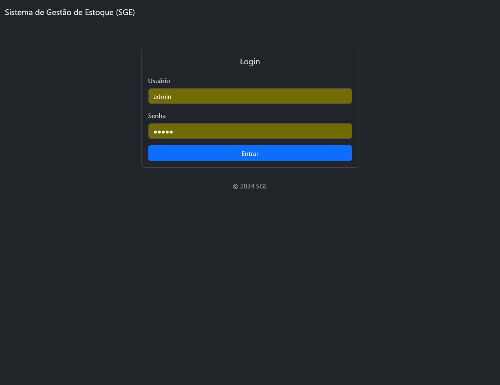
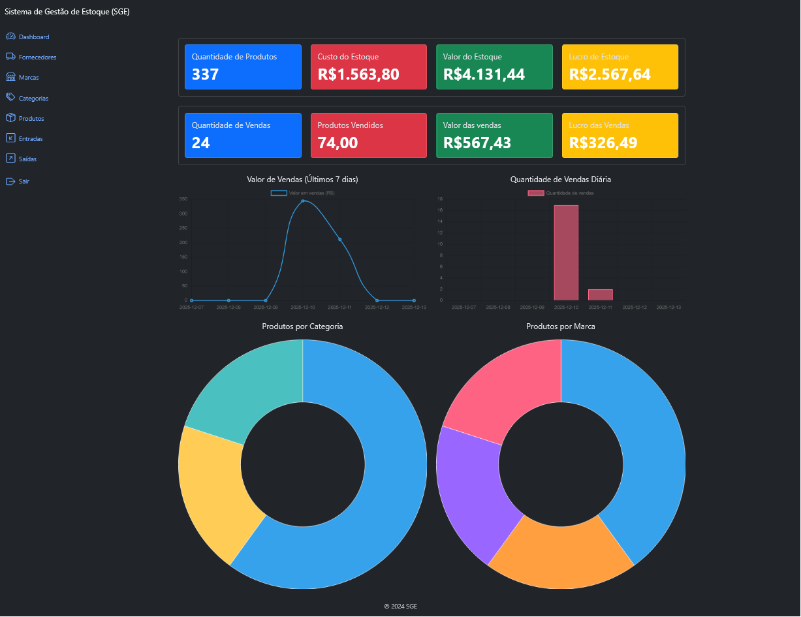
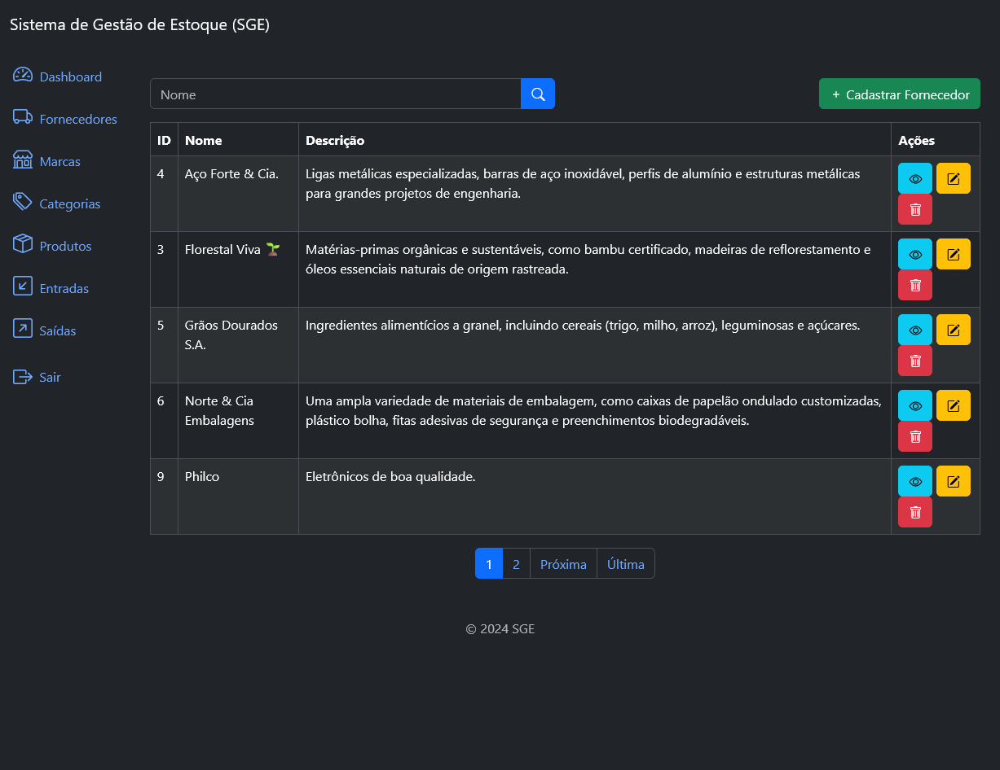
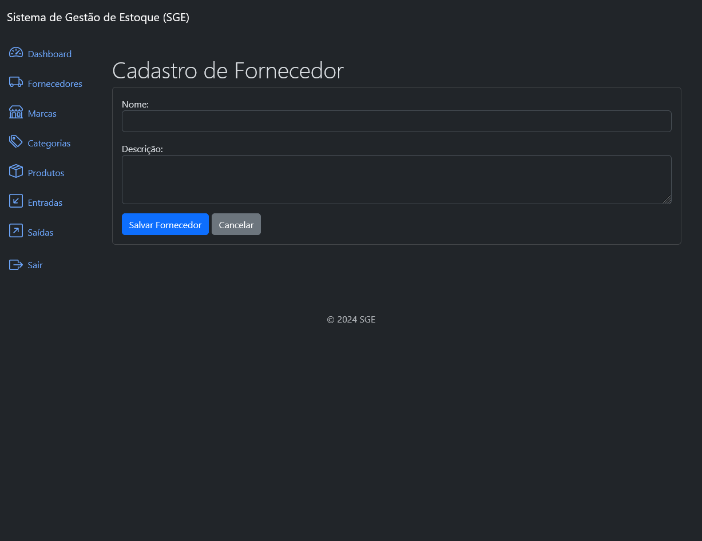
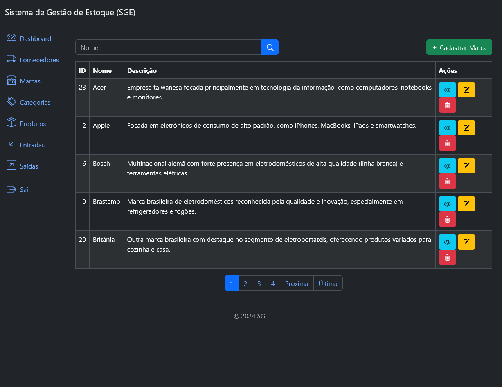
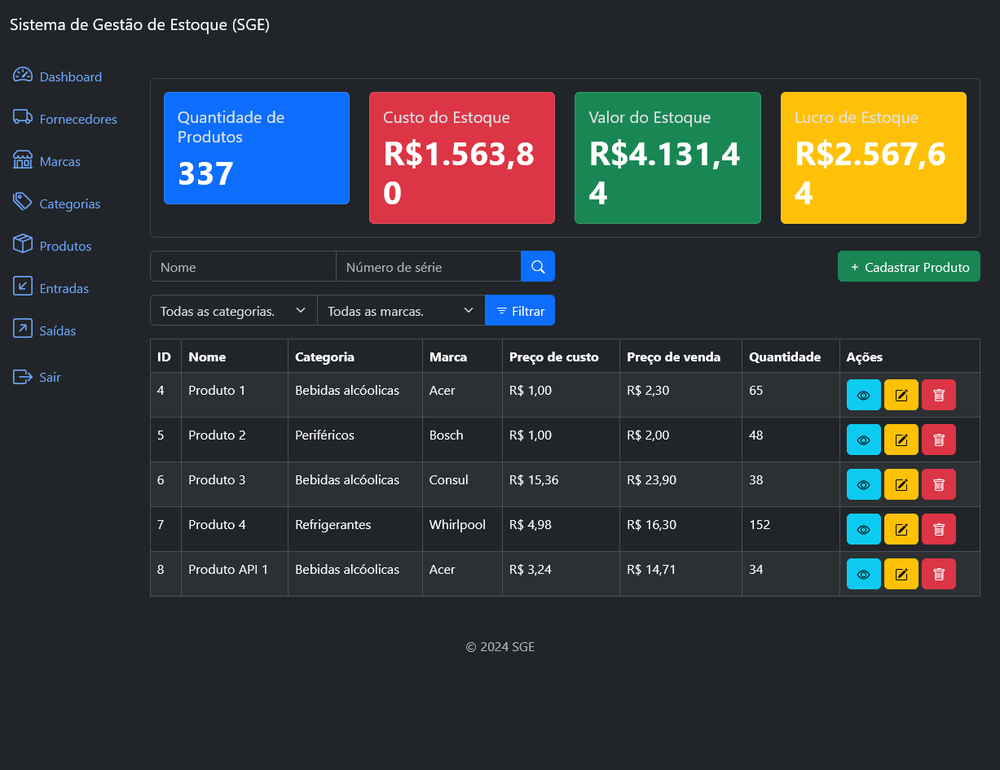
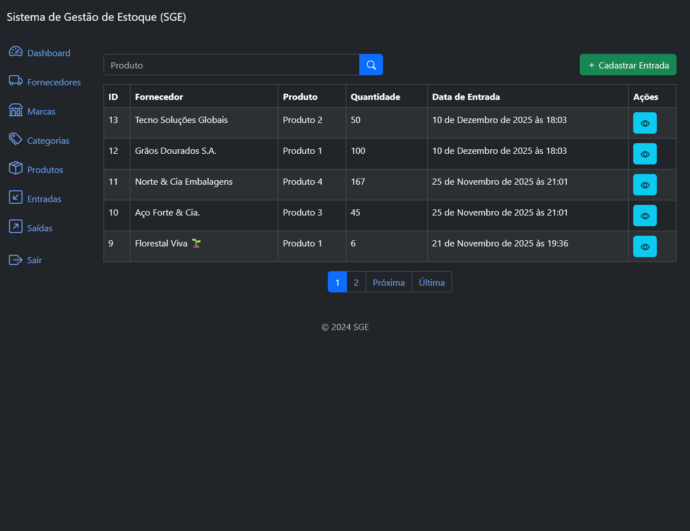
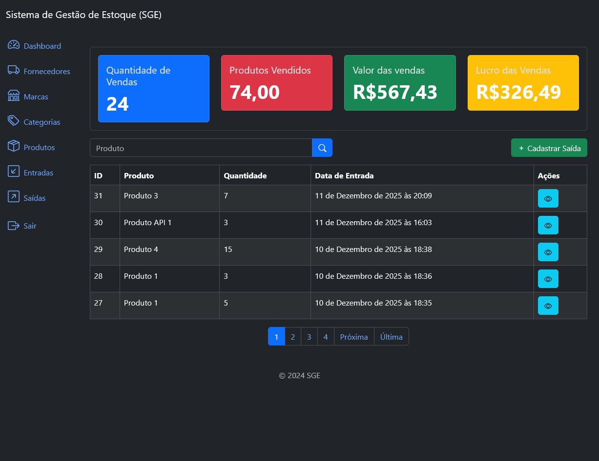
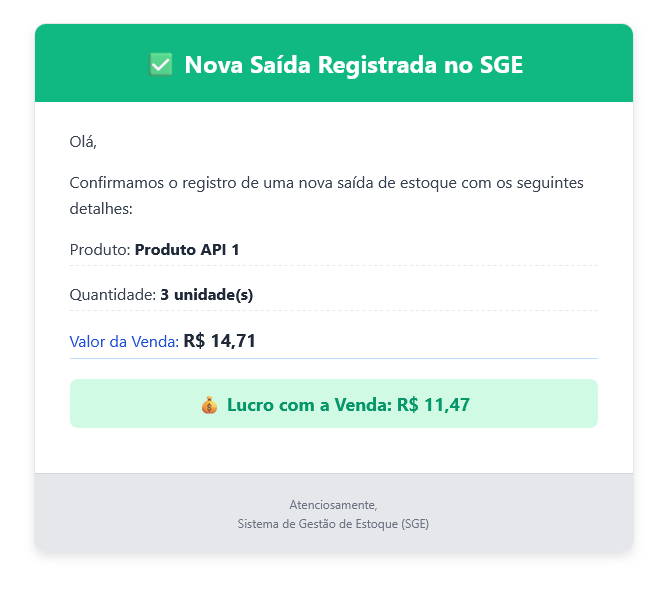
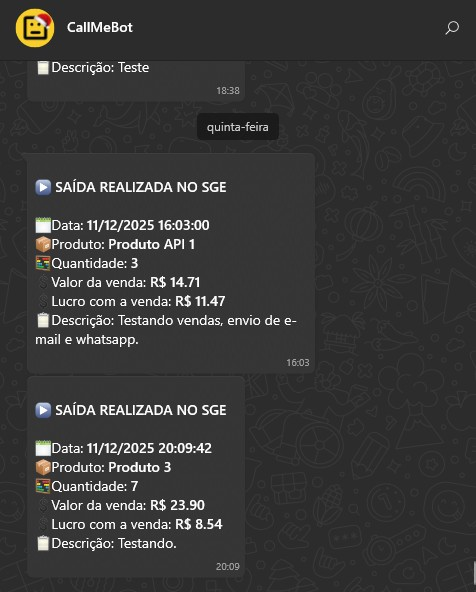

# SISTEMA_GESTÃO_ESTOQUE (SGE)

Projeto Django para gerenciamento de estoque com funcionalidades completas para produtos, categorias, marcas, fornecedores, entradas (inflows) e saídas (outflows). Inclui interface web (templates), API REST com autenticação JWT e integração com o serviço CallMeBot para envio de notificações via WhatsApp.

## O que foi feito
- Sistema CRUD para produtos com cálculo de métricas (estoque, lucro, valor total).
- Gestão de categorias, marcas e fornecedores.
- Entradas (inflows) para atualizar quantidade em estoque.
- Saídas (outflows) que atualizam rápido o estoque e geram notificações.
- Integração com CallMeBot para envio de alertas por WhatsApp quando uma saída é registrada.
- Envio de e-mail (via configurações no `settings.py`) quando ocorre uma saída.
- API REST (Django REST Framework) com serializadores e views para manipulação de recursos.
- Autenticação JWT (Django Rest Framework SimpleJWT) para proteger os endpoints da API.

## Tecnologias utilizadas
- Python 3.x
- Django 5.2.x
- Django REST framework
- djangorestframework_simplejwt (JWT)
- python-decouple (configurações via variáveis de ambiente)
- requests (para comunicação com CallMeBot)
- SQLite (banco embutido, usar outro em produção se necessário)

Veja `requirements.txt` para a lista completa de dependências.

## Estrutura do projeto
- `app/` - configurações do projeto (URLs, settings, templates, métricas)
- `authentication/` - endpoints de autenticação e JWT
- `products/`, `brands/`, `category/`, `supplier/` - apps CRUD
- `inflows/`, `outflows/` - controle de entradas/saídas de estoque, modelos, views e sinais
- `whatassistent/` - cliente para integração com CallMeBot (envia mensagens via HTTP)

## USUÁRIO E SENHA PARA TESTES DE ACESSO
👤Usuário: admin

🔐Senha: admin

https://sgeleepcode.pythonanywhere.com/login/?next=/

## Sistema de API
As APIs seguem o padrão REST e estão expostas sob o prefixo `api/v1/` para as principais entidades. Entre os endpoints mais relevantes:

- Autenticação JWT
  - `POST /api/v1/authentication/token/` - Obter pares de tokens (access e refresh).
  - `POST /api/v1/authentication/token/refresh/` - Atualizar token de acesso.
  - `POST /api/v1/authentication/token/verify/` - Verificar token.

- Produtos
  - `GET /api/v1/products/` — listar produtos
  - `POST /api/v1/products/` — criar produto
  - `GET/PUT/DELETE /api/v1/products/<id>` — recuperar/atualizar/deletar produto

- Entradas (Inflow)
  - `GET /api/v1/inflows/` — listar entradas
  - `POST /api/v1/inflows/` — criar entrada (atualiza quantidade do produto)

- Saídas (Outflow)
  - `GET /api/v1/outflows/` — listar saídas
  - `POST /api/v1/outflows/` — criar saída (atualiza quantidade do produto e dispara notificações)

- Marcas (Brands)
  - `GET /api/v1/brands/` — listar marcas
  - `POST /api/v1/brands/` — criar marca
  - `GET/PUT/DELETE /api/v1/brands/<id>` — recuperar/atualizar/deletar marca

- Categorias (Categories)
  - `GET /api/v1/categories/` — listar categorias
  - `POST /api/v1/categories/` — criar categoria
  - `GET/PUT/DELETE /api/v1/categories/<id>` — recuperar/atualizar/deletar categoria

- Fornecedores (Suppliers)
  - `GET /api/v1/suppliers/` — listar fornecedores
  - `POST /api/v1/suppliers/` — criar fornecedor
  - `GET/PUT/DELETE /api/v1/suppliers/<id>` — recuperar/atualizar/deletar fornecedor

Autenticação: a API exige que as requisições utilizem o header `Authorization: Bearer <token>` com o token JWT obtido em `authentication/token/`.

## Integração com CallMebot
O projeto contém o cliente em `whatassistent/client.py` que encapsula as chamadas ao serviço CallMeBot para envio de mensagens via WhatsApp. A integração é utilizada principalmente no `outflows/signals.py`, que sempre que uma `Outflow` é criada, monta uma mensagem formatada e a envia por WhatsApp.

Variáveis de ambiente para essa integração (utilizadas com python-decouple):
- `BASE_URL` — URL base da API do CallMeBot (ex.: `https://api.callmebot.com/whatsapp.php?`).
- `PHONE_NUMBER` — número do telefone a ser notificado no formato do serviço.
- `API_KEY` — chave (se fornecida) pelo CallMeBot.

Exemplo de uso direto do cliente (apenas para teste):

```python
from whatassistent.client import CallMeBot

c = CallMeBot()
c.send_message('Mensagem de teste do SGE')
```

No fluxo do projeto, o envio é realizado automaticamente quando um registro de saída (`Outflow`) é criado, além do envio de e-mail ao administrador.

## Configurações e variáveis de ambiente
Recomenda-se criar um arquivo `.env` ou adicionar variáveis de ambiente para armazenar configurações sensíveis e específicas do ambiente, por exemplo:

- `SECRET_KEY` (se desejar sobrescrever o do settings para produção)
- `BASE_URL` (CallMeBot)
- `PHONE_NUMBER` (CallMeBot)
- `API_KEY` (CallMeBot)
- `EMAIL_HOST`, `EMAIL_PORT`, `EMAIL_HOST_USER`, `EMAIL_HOST_PASSWORD`, `EMAIL_ADMIN_RECEIVER`

No `app/settings.py`, já existe configuração para leitura via `python-decouple`.

## Telas do sistema (Screenshots)

Exemplo de GIF:





















## Instalação e execução
1. Criar e ativar ambiente virtual.
2. Instalar dependências:

```bash
pip install -r requirements.txt
```

3. Criar as migrações e migrar o banco:

```bash
python manage.py makemigrations
python manage.py migrate
```

4. Criar um superusuário para acessar o admin (opcional):

```bash
python manage.py createsuperuser
```

5. Rodar o servidor:

```bash
python manage.py runserver
```

6. Acesse a interface web em `http://127.0.0.1:8000/`.

## Como testar a API com JWT (exemplos curl)
1. Solicitar token:

```
bashcurl -X POST http://127.0.0.1:8000/api/v1/authentication/token/ -H "Content-Type: application/json" -d '{"username":"admin","password":"admin"}'
```

2. Usar o token para acessar um endpoint protegido:

```bash
curl -H "Authorization: Bearer <ACCESS_TOKEN>" http://127.0.0.1:8000/api/v1/products/
```
